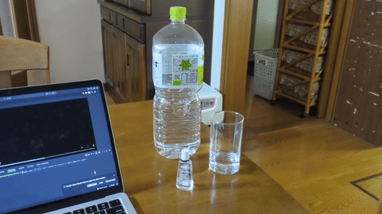
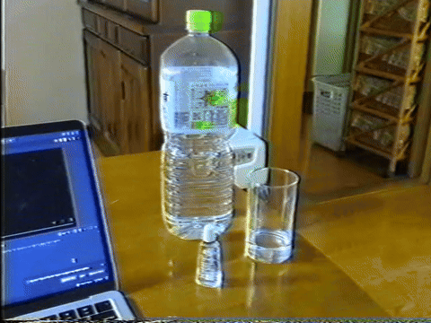

# vhsify

Fast VHS conversion for images and videos — scriptable and AI-workflow ready.

| Before | After |
|---|---|
|  |  |

## Supported formats

- Images: JPEG, PNG, WebP, AVIF
- Videos: MP4, MOV, AVI, MKV

## Installation

### Homebrew (macOS)

```bash
$ brew tap oborodice/tap
$ brew install vhsify
```

### Manual

1. Install [FFmpeg](https://ffmpeg.org/)
1. Download the binary from [GitHub Releases](https://github.com/oborodice/vhsify/releases)
1. Add it to your PATH

## Usage

```bash
# Output as <input>_vhs.<ext> in the current directory
$ vhsify <input>.<ext>

# --mode controls how wide content is handled (default: bars)
$ vhsify <input>.<ext> --mode bars  # fit into 4:3 with black bars on the sides
$ vhsify <input>.<ext> --mode crop  # crop sides to 4:3

# --output-dir specifies the output directory
$ vhsify <input>.<ext> --output-dir <dir>

# --output-name specifies the output filename (without extension)
$ vhsify <input>.<ext> --output-name <name>

# --version shows the version
$ vhsify --version

# --help shows usage
$ vhsify --help
```

## Contributing

See [CONTRIBUTING.md](CONTRIBUTING.md).
